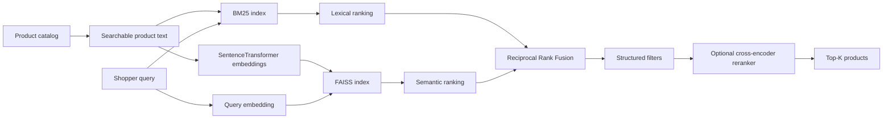

# AI E-commerce Semantic Search

A product-management case study and working AI search MVP that explores how an e-commerce marketplace can improve product discovery for conversational, synonym-heavy and attribute-rich queries.

The current prototype combines **BM25 + SentenceTransformers + FAISS + Reciprocal Rank Fusion**, with optional **cross-encoder reranking**, structured commerce filters, offline evaluation, a Streamlit demo and PR CI.

> Independent portfolio project. Public examples from Amazon, Target and Walmart are used as industry reference points; no proprietary architecture is claimed or reproduced.

## Product question

**How might an e-commerce platform help shoppers find the right products when the words they use do not exactly match the product catalog?**

Example:
- Shopper intent: `comfortable shoes for walking all day`
- Catalog language: `cushioned walking sneaker`, `memory foam`, `supportive trainer`

A keyword-only system may miss useful matches. A semantic-only system can overgeneralize. The product hypothesis is that **hybrid retrieval** provides a better balance.

## Architecture



## Why FAISS?

FAISS is a strong MVP choice because it is open source, fast, local and transparent. It demonstrates dense-vector retrieval without hiding the mechanics behind a managed platform.

For production, FAISS would be one component in a larger search system with distributed serving, metadata filters, catalog freshness, observability, replication and strict latency controls.

## Product-sense framework

The case study follows the supplied Analytical Thinking template:
1. Assumptions and scope
2. Product rationale: product, users, value, alternatives and why now
3. Ecosystem players, value propositions and must-take actions
4. Ecosystem health metrics
5. North Star metric + critique
6. Guardrails derived from North Star failure modes
7. 3–6 month team focus
8. User journey and leading metrics
9. Prioritized goal based on influence and North Star impact
10. Fundamental tradeoff, decision and what would change the decision

**North Star:** Weekly Successful Search Sessions  
**Primary offline metric:** NDCG@10  
**Guardrails:** exact-match regression, p95 latency, reformulation, poor-result rate, returns/cancellations and exposure concentration.

## Public industry reference points

- **Target:** publicly described hybrid keyword + vector search and reported improvements to relevance, no-result rate and latency in its published case study.
- **Walmart:** publicly described natural-language GenAI Search using query, session and engagement context.
- **Amazon:** has published semantic product-search research covering synonyms, spelling variation and relevance/latency tradeoffs.

See [`docs/competitive-analysis.md`](docs/competitive-analysis.md).

## Repository structure

```text
.
├── .github/workflows/ci.yml      # PR unit-test CI
├── app.py                        # Streamlit demo
├── data/
│   ├── sample_products.csv       # synthetic demo catalog
│   └── qrels.csv                 # relevance judgments
├── docs/
│   ├── case-study.md
│   ├── competitive-analysis.md
│   └── white-paper.md
├── src/
│   ├── __init__.py               # Python package marker for CI/imports
│   ├── search.py                 # SentenceTransformer + FAISS
│   ├── bm25.py                   # BM25 lexical retrieval
│   ├── hybrid.py                 # original TF-IDF + FAISS RRF baseline
│   ├── pipeline.py               # BM25 + FAISS + filters + reranking
│   ├── filters.py                # structured commerce filtering
│   ├── rerank.py                 # optional cross-encoder reranker
│   └── evaluate.py               # NDCG@10 / Recall@10 comparison
├── tests/
│   └── test_metrics.py
└── requirements.txt
```

## Run locally

```bash
python -m venv .venv
source .venv/bin/activate      # Windows: .venv\Scripts\activate
pip install -r requirements.txt
python src/evaluate.py
PYTHONPATH=. python -m pytest -q
streamlit run app.py
```

The first embedding/reranker run downloads its model and caches it locally.

## Offline experiment

| System | Role | Hypothesis |
|---|---|---|
| TF-IDF | Baseline A | Simple exact-token relevance |
| BM25 | Baseline B | Stronger lexical ranking for catalog text |
| FAISS semantic | Treatment A | Better intent/synonym recall |
| TF-IDF + FAISS RRF | Treatment B | Early hybrid baseline |
| BM25 + FAISS RRF | Treatment C | Better lexical + semantic balance |
| BM25 + FAISS + reranker | Future online candidate | Higher top-rank precision at added latency/cost |

Evaluation slices include conversational, semantic/synonym, attribute-heavy and exact queries. The labeled dataset is intentionally small and synthetic; retailer-reported improvements are **not** presented as results of this prototype.

## MVP → production roadmap

1. Replace the synthetic catalog with a larger public commerce dataset.
2. Expand human relevance judgments and query slices.
3. Benchmark BM25 vs FAISS vs hybrid by NDCG, Recall, MRR and p95 latency.
4. Add price, brand, category and availability metadata to the catalog.
5. Enable the cross-encoder only on top-N candidates and measure latency/relevance tradeoffs.
6. Add click/add-to-cart simulation or real interaction logging for online-style metrics.
7. Run A/B testing in a controlled environment before tying relevance gains to conversion.

## Documents

- [Full PM case study](docs/case-study.md)
- [Competitive analysis](docs/competitive-analysis.md)
- [White paper](docs/white-paper.md)

<!-- CI recovery sync after run #10 cancellation -->
