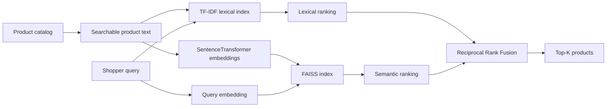

# AI E-commerce Semantic Search

A product-management case study and working AI search MVP that explores how an e-commerce marketplace can improve product discovery for conversational, synonym-heavy and attribute-rich queries.

The prototype combines **lexical retrieval + SentenceTransformers + FAISS vector search + Reciprocal Rank Fusion**, with an offline evaluation harness for comparing retrieval strategies.

> This is an independent portfolio project. Public examples from Amazon, Target and Walmart are used as industry reference points; no proprietary architecture is claimed or reproduced.

## Product question

**How might an e-commerce platform help shoppers find the right products when the words they use do not exactly match the product catalog?**

Example:

- Shopper intent: `comfortable shoes for walking all day`
- Catalog language: `cushioned walking sneaker`, `memory foam`, `supportive trainer`

A keyword-only system may miss useful matches. A semantic-only system can overgeneralize. The case-study hypothesis is that **hybrid retrieval** provides a better balance.

## Architecture



## Why FAISS?

FAISS is a strong choice for this MVP because it is open source, fast, local and transparent. It lets the project demonstrate dense-vector retrieval without hiding the mechanics behind a managed service.

For production, FAISS would be only one component. Large-scale commerce search also needs structured filtering, fresh catalog updates, high availability, distributed serving, observability and strict latency controls. The architecture intentionally keeps the vector layer replaceable.

## Product-sense framework

The case study follows the supplied Analytical Thinking template:

1. Assumptions and scope
2. Product rationale: product, users, value, alternatives and why now
3. Ecosystem players, value propositions and must-take actions
4. Ecosystem health metrics
5. North Star metric + critique
6. Guardrails derived from North Star failure modes
7. 3–6 month team focus
8. User journey and leading metrics
9. Prioritized goal based on influence and North Star impact
10. Fundamental tradeoff, decision and what would change the decision

**North Star:** Weekly Successful Search Sessions.

**Primary offline metric:** NDCG@10 on a labeled semantic-query evaluation set.

**Key guardrails:** exact-match regression, p95 latency, reformulation, poor-result rate, returns/cancellations and exposure concentration.

## Public industry reference points

- **Target (2025):** publicly described hybrid keyword + vector search. Target reported 20% better product-discovery relevance, half as many no-result queries and 60% lower vector-query response time in the cited platform case study.
- **Walmart:** publicly described GenAI Search using natural-language needs plus query/session/engagement context to understand shopping intent.
- **Amazon:** has published semantic product-search research addressing synonyms, morphological variation, spelling and large-scale relevance/latency tradeoffs.

See [`docs/competitive-analysis.md`](docs/competitive-analysis.md) for sources and interpretation.

## Repository structure

```text
.
├── data/
│   ├── sample_products.csv       # synthetic demo catalog
│   └── qrels.csv                 # human-style relevance judgments
├── docs/
│   ├── case-study.md             # PM analytical case study
│   ├── competitive-analysis.md   # Amazon / Target / Walmart evidence
│   └── white-paper.md            # product + technical white paper
├── src/
│   ├── search.py                 # SentenceTransformer + FAISS search
│   ├── hybrid.py                 # TF-IDF + semantic + RRF
│   └── evaluate.py               # NDCG@10 / Recall@10 evaluation
├── tests/
│   └── test_metrics.py
└── requirements.txt
```

## Run locally

```bash
python -m venv .venv
source .venv/bin/activate      # Windows: .venv\Scripts\activate
pip install -r requirements.txt
python src/search.py
python src/evaluate.py
pytest
```

The first SentenceTransformer run downloads the embedding model and caches it locally.

## Offline experiment

| System | Role | Hypothesis |
|---|---|---|
| TF-IDF lexical | Control | Strong exact-token precision |
| FAISS semantic | Treatment A | Better intent/synonym recall |
| Hybrid RRF | Treatment B | Best balance of lexical precision + semantic recall |

Evaluation slices include conversational, semantic/synonym, attribute-heavy and exact queries. The labeled dataset is intentionally small and synthetic for the MVP; reported retailer improvements are **not** presented as results of this prototype.

## Next iteration

The most valuable extensions are a larger labeled public commerce dataset, BM25 instead of TF-IDF, commerce-specific embeddings, cross-encoder reranking, structured price/category/availability filters, latency benchmarking and a lightweight API/demo UI.

## Documents

- [Full PM case study](docs/case-study.md)
- [Competitive analysis](docs/competitive-analysis.md)
- [White paper](docs/white-paper.md)
