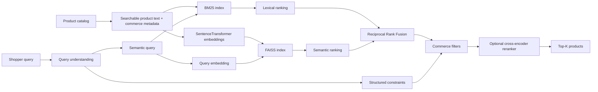

# AI E-commerce Semantic Search

A product-management case study and working AI search MVP that explores how an e-commerce marketplace can improve product discovery for conversational, synonym-heavy and attribute-rich queries.

The current prototype combines **natural-language query understanding + BM25 + SentenceTransformers + FAISS + Reciprocal Rank Fusion + structured commerce filters**, with optional **cross-encoder reranking**, offline evaluation, a Streamlit demo and PR CI.

> Independent portfolio project. Public examples from Amazon, Target and Walmart are used as industry reference points; no proprietary architecture is claimed or reproduced.

## Product question

**How might an e-commerce platform help shoppers find the right products when the words they use do not exactly match the product catalog?**

Example Phase 2 query:

`waterproof women's hiking shoes under $100 rated 4.5 stars in stock`

The query-understanding layer separates semantic intent from structured constraints:

- semantic intent: `waterproof women's hiking shoes`
- gender: `women`
- category: `Shoes`
- max price: `$100`
- minimum rating: `4.5`
- availability: `in stock`

## Architecture



## Why FAISS?

FAISS is a strong MVP choice because it is open source, fast, local and transparent. It demonstrates dense-vector retrieval without hiding the mechanics behind a managed platform.

For production, FAISS would be one component in a larger search system with distributed serving, metadata filters, catalog freshness, observability, replication and strict latency controls.

## Product-sense framework

The case study follows the supplied Analytical Thinking template:
1. Assumptions and scope
2. Product rationale: product, users, value, alternatives and why now
3. Ecosystem players, value propositions and must-take actions
4. Ecosystem health metrics
5. North Star metric + critique
6. Guardrails derived from North Star failure modes
7. 3–6 month team focus
8. User journey and leading metrics
9. Prioritized goal based on influence and North Star impact
10. Fundamental tradeoff, decision and what would change the decision

**North Star:** Weekly Successful Search Sessions  
**Primary offline metric:** NDCG@10  
**Supporting metrics:** Recall@10, MRR, average/p95 latency  
**Guardrails:** exact-match regression, p95 latency, reformulation, poor-result rate, returns/cancellations and exposure concentration.

## Public industry reference points

- **Target:** publicly described hybrid keyword + vector search and reported improvements to relevance, no-result rate and latency in its published case study.
- **Walmart:** publicly described natural-language GenAI Search using query, session and engagement context.
- **Amazon:** has published semantic product-search research covering synonyms, spelling variation and relevance/latency tradeoffs.

See [`docs/competitive-analysis.md`](docs/competitive-analysis.md).

## Repository structure

```text
.
├── .github/workflows/ci.yml       # tests + measured Phase 2 benchmark
├── app.py                         # Streamlit query-understanding/search demo
├── data/
│   ├── sample_products.csv        # synthetic commerce catalog with metadata
│   ├── qrels.csv                  # Phase 1 relevance judgments
│   └── phase2_qrels.csv           # constraint-rich Phase 2 judgments
├── docs/
│   ├── case-study.md
│   ├── competitive-analysis.md
│   └── white-paper.md
├── src/
│   ├── __init__.py
│   ├── search.py                  # SentenceTransformer + FAISS
│   ├── bm25.py                    # BM25 lexical retrieval
│   ├── hybrid.py                  # original TF-IDF + FAISS baseline
│   ├── query_parser.py            # natural-language constraint extraction
│   ├── pipeline.py                # query understanding + hybrid + filters
│   ├── filters.py                 # price/brand/gender/rating/stock filters
│   ├── rerank.py                  # optional cross-encoder reranker
│   ├── evaluate.py                # Phase 1 evaluation
│   └── phase2_benchmark.py        # four-system Phase 2 experiment
├── tests/
│   ├── test_metrics.py
│   └── test_query_parser.py
└── requirements.txt
```

## Run locally

```bash
python -m venv .venv
source .venv/bin/activate      # Windows: .venv\Scripts\activate
pip install -r requirements.txt
PYTHONPATH=. python -m pytest -q
python -m src.phase2_benchmark
streamlit run app.py
```

The first embedding/reranker run downloads its models and caches them locally.

## Phase 2 experiment

| System | Role | Hypothesis |
|---|---|---|
| BM25 | Control | Strong literal/catalog matching |
| FAISS semantic | Treatment A | Better intent and synonym recall |
| BM25 + FAISS + filters | Treatment B | Better relevance for constraint-rich commerce queries |
| Hybrid + filters + reranker | Treatment C | Better top-rank precision at additional latency/cost |

The Phase 2 benchmark reports **NDCG@10, Recall@10, MRR and average query latency**, both overall and by query slice. CI uploads the raw benchmark output as an artifact.

**No improvement percentage is claimed until the experiment has actually run.** Any X% shown in the final case study will be computed from these measured results.

## MVP → production roadmap

1. Replace/augment the synthetic catalog with a larger public commerce dataset.
2. Expand human relevance judgments and difficult query slices.
3. Benchmark relevance and p50/p95 serving latency on larger candidate sets.
4. Add stronger taxonomy/synonym handling and learned query-intent classification.
5. Tune query routing so exact SKU/model searches preserve lexical dominance.
6. Introduce interaction labels with position-bias controls.
7. Validate relevance improvements through an online A/B test before claiming conversion impact.

## Documents

- [Full PM case study](docs/case-study.md)
- [Competitive analysis](docs/competitive-analysis.md)
- [White paper](docs/white-paper.md)
