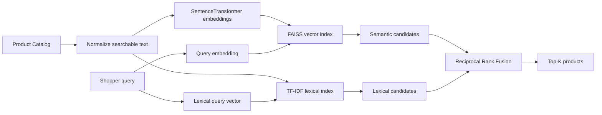

# White Paper: Hybrid Semantic Search for E-commerce Product Discovery

## Executive Summary
E-commerce search is a matching problem under business constraints. Shoppers often describe needs in language that does not exactly match catalog text, while marketplaces must still preserve precision for brands, model numbers, categories, price/availability filters and exact identifiers. This white paper proposes a hybrid search architecture that combines lexical retrieval with dense semantic retrieval and rank fusion.

The portfolio MVP uses a SentenceTransformer to encode products and queries, FAISS for dense nearest-neighbor retrieval, TF-IDF as the lexical baseline, and Reciprocal Rank Fusion (RRF) to combine both rankings. The product hypothesis is that hybrid retrieval will improve relevance for conversational, synonym-heavy and attribute-rich queries without materially degrading exact-match precision or search latency.

## 1. Problem Statement
Traditional keyword search performs well when shopper vocabulary overlaps catalog vocabulary. It can fail when intent is expressed through synonyms ("small child" vs. "toddler"), inferred use cases ("walking all day" vs. "cushioned walking sneaker"), morphological variation, misspellings or longer natural-language prompts.

The problem is not simply to maximize semantic similarity. An e-commerce system must retrieve relevant products quickly, respect structured constraints, adapt to catalog changes, avoid plausible-but-wrong results and connect relevance improvements to shopper outcomes.

## 2. Product Mission
**Help every shopper translate intent into a relevant, trustworthy set of purchasable products with minimal effort.**

This mission anchors the core tradeoff: broader semantic recall is valuable only if result precision, trust and latency remain healthy.

## 3. Analytical Thinking Framework
This case follows the Analytical Thinking template supplied for the project:

1. State assumptions and clarify scope.
2. Explain product rationale: product, users, value, alternatives and why now.
3. Map ecosystem players to value propositions and must-take actions.
4. Define ecosystem health metrics.
5. Select and critique a North Star metric.
6. Derive guardrails from the North Star's failure modes.
7. Choose a 3–6 month team focus and work backward through the user journey.
8. Prioritize a goal based on ability to influence and expected North Star impact.
9. Frame the fundamental tradeoff and state what evidence would change the decision.

## 4. Ecosystem
### Shopper
Value: quickly find products that satisfy an explicit or implicit need.
Must-take actions: search, evaluate results, click product detail, add to cart, purchase.
Health: successful-search rate, search-to-PDP CTR, reformulation, add-to-cart and conversion.

### Seller / Brand
Value: receive qualified discovery for relevant inventory.
Must-take actions: provide complete product titles, categories, attributes, inventory and offers.
Health: qualified impressions, PDP visits, conversion, returns and catalog-quality completeness.

### Marketplace
Value: match demand with supply while maintaining customer trust.
Must-take actions: retrieve, rank, filter and serve results reliably.
Health: search-assisted conversion/GMV, abandonment, latency, availability and result quality.

### Search Team
Value: improve discovery safely and measurably.
Must-take actions: label queries, build baselines, experiment, monitor slices and regressions.
Health: NDCG, Recall@K, exact-match regression, p95 latency and experiment velocity.

## 5. North Star and Guardrails
### North Star
**Weekly Successful Search Sessions** — weekly sessions in which a shopper searches and subsequently performs a high-intent action such as meaningful PDP engagement or add-to-cart.

Why it works: it is closer to realized shopper value than raw query count and connects retrieval quality to behavior.

Failure modes: price, inventory, promotions and UX can influence downstream behavior; optimizing clicks can reward clickbait-like ranking; popular products may receive disproportionate exposure.

### Guardrails
- Exact-match regression rate
- p95 search latency
- Query reformulation rate
- Zero/low-relevance result rate
- Return/cancellation proxy
- Catalog/seller exposure concentration
- Availability of surfaced products

## 6. Competitive Evidence
### Target
In a September 2025 case study, Target described a hybrid search system combining classic keyword matching with semantic vector search, structured filtering and additional ranking signals. Target reported a 20% improvement in product-discovery relevance, half as many no-result queries and a 60% reduction in vector-query response time.

Source: https://cloud.google.com/blog/topics/retail/from-query-to-cart-inside-targets-search-bar-overhaul-with-alloydb-ai

### Walmart
Walmart has described GenAI Search that accepts natural-language shopping needs and uses the query, session and item engagement to understand intent and organize relevant product offerings.

Source: https://tech.walmart.com/content/walmart-global-tech/en_us/blog/post/walmarts-generative-ai-search-puts-more-time-back-in-customers-hands.html

### Amazon
Amazon research has documented semantic product search as a way to address lexical shortcomings such as synonyms, morphology and spelling. Its 2019 work reported offline relevance gains and online A/B-test learnings. Later Amazon research described large-language-model bi-encoders for web-scale semantic product search, emphasizing the relevance/latency tradeoff.

Sources:
- https://www.amazon.science/publications/semantic-product-search
- https://www.amazon.science/publications/web-scale-semantic-product-search-with-large-language-models

These examples are public reference points only; this project does not assert knowledge of proprietary internal architectures beyond what the cited sources disclose.

## 7. Proposed MVP Architecture

### Components
**Catalog representation.** Product title, category, description and structured attributes are concatenated into a searchable document representation.

**Dense encoder.** `all-MiniLM-L6-v2` is used as a compact, easy-to-run MVP encoder. This is a prototyping choice, not a claim that it is optimal for commerce.

**FAISS.** Product embeddings are normalized and stored in a FAISS inner-product index. With normalized vectors, inner product behaves as cosine similarity.

**Lexical baseline.** TF-IDF with unigrams and bigrams protects literal token matches and supplies an interpretable baseline.

**Fusion.** RRF combines ranking position from the lexical and semantic systems without requiring the two systems' raw scores to have comparable scales.

## 8. Why FAISS
FAISS is well suited to this case-study MVP because it is open source, efficient, local and transparent. It lets the project demonstrate vector indexing and nearest-neighbor retrieval without requiring a cloud account.

FAISS is not a complete production commerce-search platform. A scaled implementation may need distributed serving, high availability, real-time catalog updates, structured filtering, access controls, observability, autoscaling and multi-region failover. The vector layer should therefore remain replaceable by a managed vector/search service when production requirements justify it.

## 9. Evaluation Design
### Hypothesis
Hybrid lexical + semantic retrieval improves relevance for intent-rich shopping queries relative to lexical retrieval alone while maintaining exact-match quality and acceptable latency.

### Offline systems
- Control: TF-IDF lexical retrieval
- Treatment A: FAISS semantic retrieval
- Treatment B: hybrid RRF retrieval

### Primary metric
**NDCG@10**, because commerce relevance is graded and position-sensitive: highly relevant products near the top matter more than merely retrieving any relevant item.

### Secondary metrics
- Recall@10
- Mean Reciprocal Rank
- Query-level win rate vs. baseline
- p50/p95 retrieval latency

### Evaluation slices
- Exact/identifier-like
- Synonym
- Conversational
- Attribute-heavy
- Long-tail
- Typo/noisy query (future dataset extension)

A system should not be declared better based only on the aggregate metric. Slice analysis is necessary because semantic systems can improve long-tail recall while harming exact queries.

## 10. Online Experiment Plan
After offline thresholds pass, run an A/B test.

**Control:** existing lexical search.

**Treatment:** hybrid retrieval for eligible semantic-intent queries, with lexical dominance preserved for SKU/model/exact-brand patterns.

**Primary online metric:** successful search sessions or search-assisted conversion.

**Secondary:** search-to-PDP CTR, add-to-cart rate and reformulation rate.

**Guardrails:** p95 latency, exact-query regressions, returns/cancellations, out-of-stock exposure and seller concentration.

### Decision rule
Ship progressively only if the treatment improves shopper success with no material degradation in precision, latency or trust guardrails. If aggregate conversion rises but return/cancellation rates or exact-query regressions worsen, do not treat the experiment as a clean win.

## 11. Fundamental Tradeoff
### Option 1: Semantic-first retrieval
Pros: high recall for conversational and synonym-heavy intent; simpler conceptual architecture.

Cons: may return semantically plausible but commercially wrong products; weaker exact-match guarantees; harder to debug.

### Option 2: Hybrid retrieval
Pros: balances lexical precision with semantic recall; supports gradual rollout and query routing; closer to public industry patterns.

Cons: additional system complexity; more tuning and observability; duplicate/fusion behavior must be managed.

### Decision
Choose **hybrid retrieval** for the MVP and initial production hypothesis. This best aligns with the mission because it improves discovery without unnecessarily sacrificing precision.

I would change this decision if a semantic-first system demonstrates statistically meaningful online gains across both semantic and exact-query slices while meeting latency and trust guardrails.

## 12. Product Roadmap
### Phase 1 — Portfolio MVP
Synthetic catalog, lexical baseline, FAISS semantic retrieval, RRF fusion, labeled qrels and offline metrics.

### Phase 2 — Better relevance
Commerce-specific embedding model, hard-negative mining, cross-encoder reranking and richer query labels.

### Phase 3 — Commerce constraints
Price/category/brand/availability filters, query-intent classification and business-rule integration.

### Phase 4 — Learning loop
Use anonymized click/add-to-cart/purchase labels, debias position effects, retrain representations, build experimentation and monitoring dashboards.

### Phase 5 — Multimodal/agentic discovery
Image-text embeddings, natural-language constraint extraction and task-oriented shopping experiences where justified by user need.

## 13. Risks and Responsible Use
- Behavioral labels can amplify popularity and position bias.
- Semantic matching can overgeneralize intent.
- Personalized search can create unfair exposure concentration.
- Product attributes may be incomplete or misleading.
- Generative layers must not fabricate product facts, price or availability.
- Privacy-sensitive behavioral data should be minimized, governed and appropriately aggregated.

## 14. SEO vs. On-site Search
This project primarily optimizes **on-site product search**, not external search-engine SEO. The two can share catalog-enrichment assets—clean titles, attributes, taxonomy and structured product information—but have different objectives and ranking systems. A future extension can use query-gap insights to improve category landing pages and product metadata for organic acquisition without claiming that the FAISS index itself affects Google rankings.

## Conclusion
The case study demonstrates a product-management approach to applied AI: start with a user problem, define ecosystem value and measurable goals, establish a baseline, introduce the smallest useful AI component, evaluate by slices, protect guardrails and make the architecture replaceable. FAISS is the right vector-search choice for this MVP because it makes semantic retrieval tangible and reproducible while keeping the product discussion focused on relevance, experimentation and customer outcomes.
